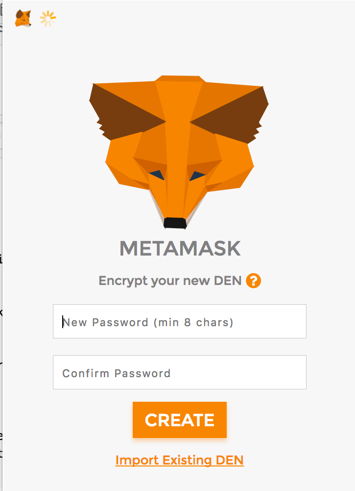
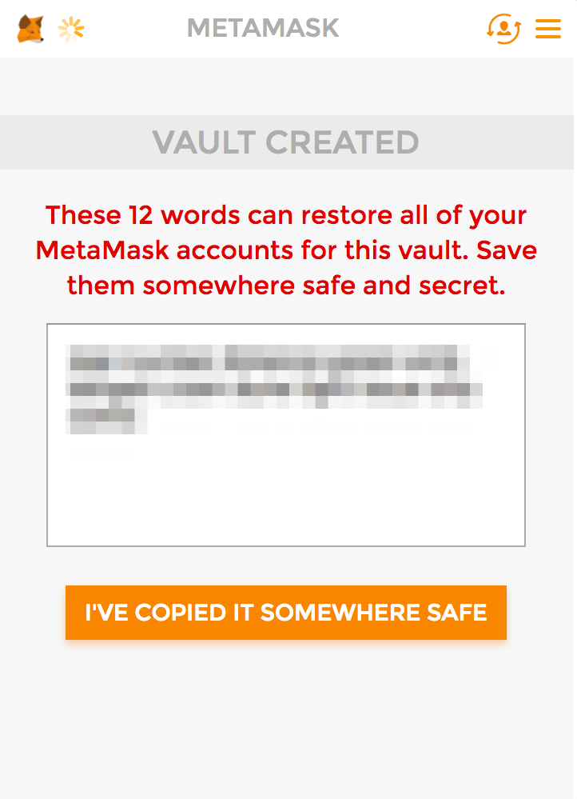
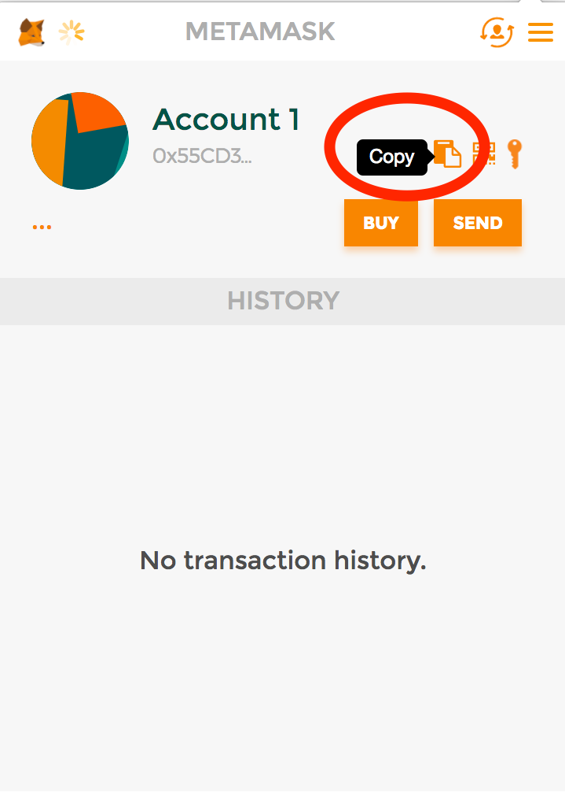

MetaMask
========

[MetaMask](https://metamask.io/) is a handy project from Consensys that lets you transact in Ether without syncing the
entire blockchain and running a node. It's an easy-to-use Ethereum wallet in your browser, for participating in dapps.
It has a cute papercraft fox maskot (a mascot mask) who swivels to follow your cursor around.
It's a mask because it protects your privacy, and it's meta because something something cryptography.

It encrypts your keys locally, in a file on your laptop, which is never sends unencrypted to Metamask's servers
It will contact Metamask's APIs to interact with the Ethereum blockchain.

First, some terminology.

* *Dapp / smart contract* -- A distributed app, or a smart contract, is a program written to run on the Ethereum blockchain.
It is compiled down to the Ethereum Virtual Machine (EVM) and can operate with variables and functions just like a normal
program, with the additional feature of being intimately linked with money (the Ether cryptocurrency).
* *Ethereum account / address* -- these are used interchangeably to mean a long hexadecimal string that is used to
identify your transactions on the Ethereum blockchain, that other people can send money to.
* *Wallet* -- a software object or graphical interface that let's you interact with your Ethereum account, send money to other people,
and participate in dapps (which requires spending money).
* *Secrets* -- any information that you should keep secret, that allow you to access your wallet, spend money from it, and
conduct transactions. These include your password, used to encrypt your wallet, and your vault words (sometimes called
wallet words) which help reconstruct your wallet if it's lost.

When setting up an account within MetaMask, you will be responsible for keeping your own account secrets, which may be a twelve-word seed phrase, an account file, or other locally stored secret information. MetaMask encrypts this information locally with a password you provide, that we never send to our servers. 

Before we continue, some warnings:
* MetaMask is beta software.
* *Back up your keys.* If you lose them, you will be unable to access funds in your wallet and no one can help you.
* *Don't leave a lot of money* in it unless you can afford to lose it. Try a little bit just for participating in toy contracts before you lean on it heavily.
* When you log in to MetaMask, your current account is visible to every new site you visit.
* For your privacy, for now, please sign out of MetaMask when you're done using a site.
* By default, you will be signed in to a test network. To use real Ether, you must connect to the main network manually in the top left network menu.

## Installing MetaMask

1. Go to http://metamask.io and click on the link "Install Chrome Plugin"

2. Read the warnings (same as above) and click Continue.

3. Read the agreement click Continue to accept. (I've read it, and it's benevolent).

4. *Secret*. You will be asked to create a DEN password (in keeping with the fox theme). This is the password used to encrypt your files locally, so keep this safe somewhere!
In Dashlane, 1Password, LastPass, or encrypted in your notetaking software like Evernote. KEEP THIS SECRET. Don't share this with anyone, post it in public,
or take screenshots. It will let someone who has access to your computer spend your money.

5. *Secret*. You will then be given 12 vault words. These are human-readable, easy-to-remember mnemonics that can be used to reconstruct
your wallet if your browser files become corrupted, or your computer gets destroyed. KEEP THIS SECRET.

6. Finally, you will see your account home.

## Accessing your Account

1. In your account home, click the "Copy" icon to copy your Ethereum address as a long hexadecimal string.
You don't need to keep this secret, and in fact, most people make them public so that anyone can send them money.
For example, my Ethereum account for my first Metamask wallet is: `0x55CD34a38FE85C02995243b2A722F00dFD84720e`

After you copy it, paste it into a text editor somewhere.

2. What good is a wallet if it can't hold money? Next, we'll get some sweet sweet testnet Ether (play money)
Go to the [Ethereum testnet faucet for Ropsten](http://ipfs.b9lab.com:8080/ipfs/QmTHdYEYiJPmbkcth3mQvEQQgEamFypLhc9zapsBatQW7Y/throttled_faucet.html), the current Ethereum testnet.
[Click here to read more about the Ropsten faucet](https://blog.b9lab.com/when-we-first-built-our-faucet-we-deployed-it-on-the-morden-testnet-70bfbf4e317e).

